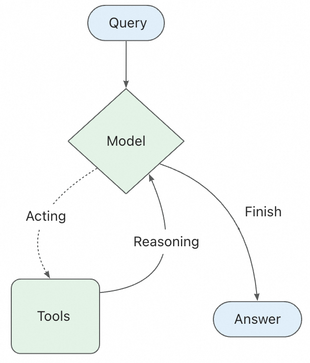

# LangChain Agents 核心概念教程

---

## 一、什么是 Agent？

### 1.1 从 LLM 到 Agent 的演进

传统的 LLM（大语言模型）是一个**问答机器**：你输入问题，它返回答案。但它有一个根本性限制——**无法与外部世界交互**。它不能搜索网页、不能调用 API、不能读写文件，它的知识仅限于训练时的数据。

**Agent（智能体）** 的出现打破了这个限制。Agent = LLM + 工具 + 循环推理。它不仅"知道"，还能"行动"。

```
LLM:  "我认为巴黎现在的天气可能不错。"  ← 只是猜测
Agent: "让我查一下巴黎的实时天气..."    ← 调用工具 → "巴黎现在晴天，22°C" ← 基于事实
```

### 1.2 Agent 的定义

在 LangChain 中，Agent 是一个**具备自主决策能力的系统**，它能够：

- **理解任务**：分析用户输入，理解需要做什么
- **制定计划**：决定需要哪些步骤来完成任务
- **选择工具**：根据当前状态，选择合适的工具执行
- **迭代推理**：根据工具返回的结果，继续推理下一步
- **输出结果**：当任务完成时，给出最终答案

### 1.3 Agent 的"大脑"示意图


> 上图展示了 Agent 的核心组成：模型作为推理中心，连接各种工具，形成完整的感知-决策-执行闭环。

---

## 二、Agent 的核心工作原理：ReAct 模式

### 2.1 什么是 ReAct？

ReAct = **Reasoning（推理）** + **Acting（行动）**。这是 Agent 的核心思维模式。

想象你被问到一个问题："张三的生日是什么时候？他的星座适合去巴黎旅行吗？"

你的思考过程会是：

```
思考1：我需要先找到张三的生日          ← Reasoning
行动1：查询数据库中张三的信息           ← Acting
观察1：张三的生日是 3月15日             ← 观察结果

思考2：我需要知道3月15日是什么星座     ← Reasoning  
行动2：查询星座日期对照表               ← Acting
观察2：3月15日是双鱼座                  ← 观察结果

思考3：我需要了解双鱼座是否适合去巴黎   ← Reasoning
行动3：搜索旅行建议                     ← Acting
观察3：搜索结果建议春季去巴黎很好       ← 观察结果

最终答案：张三是双鱼座，春季（3月）去巴黎很合适！
```

这就是 ReAct 模式——**每思考一步，就采取一次行动，根据行动结果继续思考**。

### 2.2 Agent 的执行循环

下图展示了 ReAct Agent 的完整执行流程：



> 上图说明：用户输入 QUERY 传递给 LLM，模型判断是否需要调用工具 TOOL。如果调用工具，执行后返回 observation 观察结果，模型据此迭代推理；如果不需要工具，则直接输出 ANSWER 完成回答。

也可以用简化的流程图来理解：

```
┌─────────────────────────────────────────────────────────┐
│                    Agent 执行循环                         │
│                                                         │
│   用户输入 ──► ┌──────────┐                              │
│                │  LLM 推理 │                               │
│                └─────┬────┘                              │
│                      │                                    │
│              ┌───────▼───────┐                           │
│              │ 需要调用工具？ │                           │
│              └───┬───────┬───┘                           │
│                  │ 是     │ 否                            │
│                  │        │                               │
│            ┌─────▼┐   ┌──▼──────┐                        │
│            │执行工具│   │输出答案 │                        │
│            └─────┬┘   └─────────┘                        │
│                  │                                        │
│            ┌─────▼────┐                                  │
│            │观察结果   │── 回到 LLM 推理                  │
│            └──────────┘                                  │
└─────────────────────────────────────────────────────────┘
```

这个循环会持续进行，直到：
- LLM 认为任务完成，输出最终答案
- 达到了最大迭代次数（防止无限循环）

---

## 三、Agent 的四大核心组件

### 3.1 模型（Model）—— Agent 的"大脑"

模型是 Agent 的推理引擎，负责：

- **理解用户意图**：解析输入，理解要做什么
- **决策工具选择**：当有多个工具可用时，决定用哪个
- **整合信息**：将工具的观察结果整合成连贯的答案

**关键概念：模型是可以动态切换的**

```
场景：一个客服 Agent

用户问："我的订单在哪？"        ──► 使用小模型（便宜、快速）
用户问："请帮我分析这份合同"    ──► 使用大模型（更准确、更强大）
```

通过中间件（Middleware），你可以在运行时根据任务复杂度、用户权限、成本考虑等因素，动态选择合适的模型。

### 3.2 工具（Tools）—— Agent 的"手脚"

工具是 Agent 与外部世界交互的桥梁。每个工具本质上是一个函数，但它有三个关键部分：

| 部分 | 作用 | 示例 |
|------|------|------|
| **名称** | 让 LLM 识别这个工具 | `search_web` |
| **描述** | 告诉 LLM 何时使用它 | "搜索互联网获取最新信息" |
| **参数定义** | 规定如何调用它 | `query: str` |

**为什么描述很重要？**

LLM 是根据描述来决定是否使用工具的。如果描述模糊，LLM 可能会：
- 不知道该什么时候用这个工具
- 错误地在不合适的场景使用它

```python
# ❌ 差的描述
@tool
def search(query: str) -> str:
    """搜索信息。"""
    ...

# ✅ 好的描述
@tool
def search_web(query: str) -> str:
    """搜索互联网获取最新的新闻、事实和实时信息。
    
    当你需要 2024 年之后的最新数据时使用此工具。
    不适合用于数学计算或代码生成。
    
    Args:
        query: 搜索关键词（建议 2-10 个词）
    """
    ...
```

**工具的并行调用**

Agent 可以**同时调用多个工具**，就像人可以一边查资料一边看日历：

```
用户问："北京和上海现在的天气哪个更好？"

Agent 同时调用：
  - get_weather("北京")  ─┐
                           ├── 并行执行，节省时间
  - get_weather("上海")  ─┘
```

### 3.3 系统提示词（System Prompt）—— Agent 的"性格"

系统提示词定义了 Agent 的：
- **角色定位**：你是客服？是分析师？是代码助手？
- **行为准则**：应该怎么做，不应该怎么做
- **输出格式**：答案应该是什么样子

```python
# 客服 Agent
system_prompt = """你是一个专业的客服助手。
- 始终友好、耐心地回答用户问题
- 如果不确定答案，不要编造，明确告知用户
- 涉及订单、账户等敏感信息时，先验证用户身份
"""

# 代码审查 Agent  
system_prompt = """你是一个严格的代码审查专家。
- 只关注代码的正确性和安全性
- 不要重写用户的代码，只指出问题
- 引用具体的代码行号
"""
```

**动态提示词**：提示词不一定是静态的。你可以根据运行时状态动态生成提示词。例如，对于不同权限的用户，显示不同的指导语。

### 3.4 记忆（Memory）—— Agent 的"经验"

没有记忆的 Agent 是"金鱼"——每次对话后什么都忘了。

```
无记忆的情况：
用户："我叫小明"
Agent："好的，小明！"

（下一次对话）
用户："我叫什么名字？"
Agent："我不知道。"  ← 忘了！
```

**Checkpointer（检查点）** 是 LangChain 中实现记忆的机制：

```
启用 Checkpointer 后：
用户："我叫小明"
Agent 保存状态 ──► [线程ID: session-1]

（下一次对话，使用同一个线程ID）
用户："我叫什么名字？"
Agent 加载状态 ──► "你叫小明！"  ← 记住了！
```

---

## 四、中间件（Middleware）—— Agent 的"神经系统"

中间件是 LangChain Agent 最强大的特性之一。它在 Agent 的核心循环中**插入自定义逻辑**，让你能够控制和扩展 Agent 的行为。

### 4.1 中间件的工作原理

```
用户请求 ──► [中间件1] ──► [中间件2] ──► Agent 核心循环 ──► [中间件3] ──► 响应
              │            │                                    │
              拦截          拦截                                  拦截
```

中间件可以在以下阶段介入：
- **模型调用前后**（`@wrap_model_call`）
- **工具调用前后**（`@wrap_tool_call`）
- **提示词生成阶段**（`@dynamic_prompt`）

### 4.2 常见的中间件场景

**场景 1：人类审核（Human-in-the-Loop）**

```
Agent 想执行危险操作（如删除数据库）：
  ──► 中间件拦截
  ──► 暂停执行，等待人类批准
  ──► 人类确认："是的，继续"
  ──► 中间件放行
  ──► 工具执行
```

**场景 2：工具错误处理**

```
Agent 调用 API 工具，但 API 超时：
  ──► @wrap_tool_call 中间件捕获异常
  ──► 返回自定义错误消息："API 调用失败，请重试或换其他方式"
  ──► Agent 根据错误消息调整策略，尝试其他工具
```

**场景 3：动态工具过滤**

```
不同用户权限下的工具可见性：
  - 普通用户：只能用 [search, read_doc]
  - 管理员：可用 [search, read_doc, delete_record, create_user]
  
中间件根据用户权限动态过滤工具列表
```

---

## 五、Agent 的不同形态

LangChain 没有硬编码"类型A Agent"或"类型B Agent"，而是通过配置形成不同的形态：

### 5.1 静态配置型

模型和工具在创建时确定，整个执行过程不变。

```
适用场景：简单的、可预测的任务
示例：天气查询 Agent、数学计算 Agent
```

### 5.2 动态自适应型

通过中间件，在运行时根据上下文动态调整。

```
适用场景：复杂、多变的业务场景
示例：
  - 根据用户角色动态暴露敏感工具
  - 根据任务复杂度切换大小模型
  - 根据对话阶段调整提示词
```

### 5.3 结构化输出型

强制 Agent 返回特定的数据格式，而不是自由文本。

```
适用场景：需要后续程序处理 Agent 输出的场景
示例：
  - 提取联系人信息 → 返回 {name, email, phone}
  - 分析产品评价 → 返回 {product, sentiment, rating}
```

---

## 六、最佳实践与设计哲学

### 6.1 命名规范

- **使用 `snake_case`**（如 `search_web`，而不是 `searchWeb` 或 `search web`）
- 原因：某些 LLM 厂商对空格和特殊字符的处理不一致，`snake_case` 兼容性最好

### 6.2 空工具列表的处理

如果你给 Agent 传一个空工具列表，它会自动退化为**纯 LLM 节点**——只做推理，不调用工具。这是一个有用的降级策略。

### 6.3 控制迭代次数

```python
# 防止 Agent 无限循环
result = agent.invoke(
    {"messages": [{"role": "user", "content": "做调研"}]},
    config={"recursion_limit": 10},  # 最多 10 步
)
```

这就像是给 Agent 一个"预算"——它必须在预算内完成任务，否则会被强制终止。

### 6.4 状态类型的限制

从 LangChain v1.0 开始，自定义状态模式（State Schema）**必须**使用继承自 `AgentState` 的 `TypedDict`。Pydantic 模型或 dataclass 不再支持。这是一个重要的技术约束。

### 6.5 使用 LangSmith 追踪调试

强烈建议结合 LangSmith 平台追踪 Agent 的执行过程。它可以：
- 记录每一步的推理和工具调用
- 可视化 Agent 的执行路径
- 评估 Agent 的性能

---

## 七、快速入门示例

```python
from langchain.agents import create_agent
from langchain_core.tools import tool

# 1. 定义工具
@tool
def get_weather(location: str) -> str:
    """查询指定城市的实时天气。
    
    Args:
        location: 城市名称
    """
    # 实际场景中这里会调用天气 API
    return f"{location}: 晴天，22°C"

# 2. 创建 Agent
agent = create_agent(
    model="anthropic:claude-sonnet-4-5",
    tools=[get_weather],
    system_prompt="你是一个有用的助手。"
)

# 3. 调用 Agent
result = agent.invoke({
    "messages": [{"role": "user", "content": "北京现在天气怎么样？"}]
})

# 4. 获取回答
print(result["messages"][-1].content)
```

**执行过程解析**：

```
1. 用户问："北京现在天气怎么样？"
2. Agent 推理：我需要查询天气
3. 调用 get_weather("北京")
4. 观察结果："北京: 晴天，22°C"
5. Agent 整合信息，输出最终答案
```

---

## 八、总结：Agent 的本质

| 概念 | 比喻 | 作用 |
|------|------|------|
| **模型** | 大脑 | 负责推理和决策 |
| **工具** | 手脚 | 负责执行实际操作 |
| **系统提示词** | 性格 | 定义行为准则和角色 |
| **记忆** | 经验 | 保留跨对话的知识 |
| **中间件** | 神经系统 | 拦截和控制信息流 |

Agent 的本质是**让 LLM 从被动的问答机器变成主动的行动者**。它通过循环推理和工具调用的结合，能够解决需要多步推理和外部交互的复杂任务。

---

> **下一步学习建议**：
> 1. 实践上述示例，理解 Agent 的执行流程
> 2. 尝试添加更多工具，观察 Agent 如何选择
> 3. 学习中间件的深入用法，实现人类审核和错误处理
> 4. 探索多 Agent 协作的场景
